# wpt — waypoint

> A blazing-fast, folder-aware task tracker for your terminal. Built for developers who live in the command line.

```
  ● [1] fix auth bug
  ◆ [1] Update deps  [██████░░░░] 2/3 (66%)
```

`wpt` tracks tasks and epics anchored to directories. When you `cd` into a project, your pending tasks are right there. No context switching, no app to open.

---

## Demo



## Install

```bash
git clone https://github.com/you/wpt
cd wpt
go build -o wpt .
mv wpt /usr/local/bin/
```

**Requirements:** Go 1.21+

### Zsh hook (the magic part)

Add to your `.zshrc`:

```zsh
chpwd() { wpt list }
```

Now every `cd` automatically shows pending tasks for that directory. Silent if there's nothing to do.

---

## Storage

Tasks are stored in `~/.local/share/wpt/tasks.json` (XDG-compliant). Plain JSON — portable, human-readable, no database, no daemon.

```json
{
  "tasks": [
    {
      "id": "18a4aef5",
      "name": "fix auth bug",
      "folder": "/home/user/projects/api",
      "status": "pending",
      "created_at": "2026-04-09T15:00:00Z"
    }
  ],
  "epics": []
}
```

---

## Commands

### `wpt add` — add a task

```bash
wpt add "fix auth bug"                  # add to current directory
wpt add ~/projects/api "deploy"         # add to a specific path
wpt add ~/my-apps "update deps" -r      # add one task per subfolder
```

### `wpt list` — list tasks

```bash
wpt list                    # pending tasks in current directory (chpwd hook)
wpt list -d                 # completed tasks here
wpt list -a                 # all pending tasks everywhere
wpt list -a ~/my-apps       # all pending under a path prefix
wpt list -a -d              # all completed tasks everywhere
```

### `wpt done` — mark a task done

```bash
wpt done                    # mark done (fails loud if ambiguous)
wpt done 2                  # mark task #2 done
wpt done "fix auth"         # mark by name match
wpt done ~/projects/api 1   # mark task #1 done at a specific path
```

If multiple tasks exist and no filter is given, `wpt` lists them and exits — it never silently picks one.

---

## Epics

Epics are groups of tasks spread across multiple folders. Progress is tracked automatically.

```
  ◆ [1] Update deps  [██████░░░░] 2/3 (66%)
```

### Create an epic

```bash
# One task per subfolder (named "Update deps - app1", "Update deps - app2", etc.)
wpt epic add ~/my-apps "Update deps" -r

# Empty epic — add folders manually
wpt epic add "Q4 release"
```

### Manage tasks in an epic

```bash
wpt epic task "Q4 release" ~/my-apps/app4   # track a new folder
wpt epic list                                # show epics + subtask detail
wpt epic list -a                             # all epics everywhere
```

### Complete epic tasks

```bash
# From a tracked subfolder — marks that folder's task done
wpt epic done ~/my-apps "Update deps"

# By index (epic #1, subfolder #2) — no path typing needed
wpt epic done 1 2

# By name match
wpt epic done 1 app3

# Force-complete all remaining tasks
wpt epic done 1 --force
```

### What you see where

| Location | `wpt list` shows |
|---|---|
| Parent folder (`~/my-apps`) | Epic summary with progress bar |
| Subfolder (`~/my-apps/app1`) | The task + epic membership line |

```bash
# in ~/my-apps
$ wpt list
  ◆ [1] Update deps  [██████░░░░] 2/3 (66%)

# in ~/my-apps/app1
$ wpt list
  ● [1] Update deps - app1
  ◆ Update deps › ●  Update deps - app1  (pending · epic 2/3)
```

---

## Flags

| Flag | Short | Description |
|---|---|---|
| `--all` | `-a` | Show across all directories |
| `--done` | `-d` | Show completed items |
| `--recursive` | `-r` | One task/epic per direct subfolder |
| `--force` | `-f` | (epic done) complete all tasks |

---

## Full example workflow

```bash
cd ~/my-apps

# Track a release across all apps
wpt epic add "v2.0 release" -r

# See the overview
wpt list
#   ◆ [1] v2.0 release  [░░░░░░░░░░] 0/4 (0%)

# Work on app1
cd app1
wpt list
#   ● [1] v2.0 release - app1
#   ◆ v2.0 release › ●  v2.0 release - app1  (pending · epic 0/4)

# ... do the work, then mark it done
wpt epic done ~/my-apps "v2.0" 1

# Back at the parent
cd ~/my-apps
wpt list
#   ◆ [1] v2.0 release  [██░░░░░░░░] 1/4 (25%)

# Ship everything
wpt epic done 1 --force
#   ✔ v2.0 release - app2 marked done
#   ✔ v2.0 release - app3 marked done
#   ✔ v2.0 release - app4 marked done
#   ◆ v2.0 release  [██████████] 4/4 (100%)
#   🎉 epic force-completed!
```

---

## Future ideas

- SQLite backend for very large task sets
- Task tagging and filtering
- `wpt go <task>` — shell function to `cd` to a task's folder
- Colored output themes
- Task expiry / due dates

---

## License

MIT
